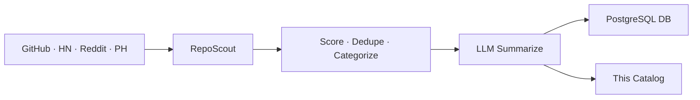

# 🌟 Open Scout Catalog

> Auto-curated catalog of promising open-source projects.
> Scouted from GitHub · HackerNews · Reddit · ProductHunt. Updated every 30 minutes by [RepoScout](https://github.com/kirbudilov01/reposearchengine).

---

## 📊 At a glance

| | |
|---|---|
| 🗂️ **Total projects** | **8084** |
| 📁 **Categories** | **22** |
| 🔄 **Auto-sync** | every 30 min via GitHub Actions |
| 🧠 **Summaries** | LLM-generated (OpenRouter · Ollama · Claude · OpenAI) |

## 🗂️ Categories

| Category | Projects | |
|---|---|---|
| 🤖 **AI/ML** | 2855 | [Browse →](./aiml/) |
| 📦 **Misc** | 1445 | [Browse →](./misc/) |
| 🎨 **Frontend** | 781 | [Browse →](./frontend/) |
| 🧩 **Orchestration** | 683 | [Browse →](./orchestration/) |
| 🔧 **DevTools** | 432 | [Browse →](./devtools/) |
| ⚙️ **Backend** | 381 | [Browse →](./backend/) |
| ⛓️ **Crypto** | 281 | [Browse →](./crypto/) |
| 🏷️ **Mcp** | 219 | [Browse →](./mcp/) |
| 📊 **Data** | 185 | [Browse →](./data/) |
| 🏷️ **Automation** | 141 | [Browse →](./automation/) |
| 💳 **Payments** | 131 | [Browse →](./payments/) |
| 🏷️ **Knowledgerag** | 100 | [Browse →](./knowledgerag/) |
| 📱 **Mobile** | 92 | [Browse →](./mobile/) |
| 📈 **Trading** | 90 | [Browse →](./trading/) |
| 🚀 **DevOps & Infra** | 77 | [Browse →](./devopsinfra/) |
| 🔐 **Security** | 64 | [Browse →](./security/) |
| 🏷️ **Database** | 60 | [Browse →](./database/) |
| ✨ **Design** | 26 | [Browse →](./design/) |
| 🎯 **Product** | 15 | [Browse →](./product/) |
| 🏷️ **Observability** | 13 | [Browse →](./observability/) |
| 🏷️ **Marketing** | 10 | [Browse →](./marketing/) |
| 🏷️ **Education** | 3 | [Browse →](./education/) |

## 🔥 Top 10 by score

| # | Project | Stars | Category |
|---|---|---|---|
| 1 | [google-gemini/gemini-cli](./aiml/google-gemini-gemini-cli.md) | ⭐ 103.3k | AI/ML |
| 2 | [n8n-io/n8n](./aiml/n8n-io-n8n.md) | ⭐ 186.9k | AI/ML |
| 3 | [PipedreamHQ/pipedream](./backend/pipedreamhq-pipedream.md) | ⭐ 11.3k | Backend |
| 4 | [ohmyzsh/ohmyzsh](./aiml/ohmyzsh-ohmyzsh.md) | ⭐ 186.9k | AI/ML |
| 5 | [teng-lin/notebooklm-py](./aiml/teng-lin-notebooklm-py.md) | ⭐ 12.9k | AI/ML |
| 6 | [rocketride-org/rocketride-server](./orchestration/rocketride-org-rocketride-server.md) | ⭐ 2.4k | Orchestration |
| 7 | [open-webui/open-webui](./aiml/open-webui-open-webui.md) | ⭐ 136.1k | AI/ML |
| 8 | [googleapis/mcp-toolbox](./aiml/googleapis-mcp-toolbox.md) | ⭐ 15k | AI/ML |
| 9 | [danny-avila/LibreChat](./orchestration/danny-avila-librechat.md) | ⭐ 36.7k | Orchestration |
| 10 | [BerriAI/litellm](./orchestration/berriai-litellm.md) | ⭐ 46k | Orchestration |

## 🚀 How it works



1. **Discover** — 4 sources pulled in parallel
2. **Score** — weighted: usefulness, quality, integration, production readiness, outlook, adoption
3. **Categorize** — rule-based tagging across product domains, integrations, MCP, RAG, automation and infrastructure
4. **Summarize** — concise RU/EN/ZH summaries via LLM with deterministic fallback
5. **Sync** — markdown committed here, metadata upserted to PostgreSQL

## 🛠️ Self-host

```bash
git clone https://github.com/kirbudilov01/reposearchengine
cp .env.example .env
# Set LLM_PROVIDER, CATALOG_REPO_PATH, DATABASE_URL, ...
npm install && npm start
```

Supports local LLMs (Ollama) and cloud providers (OpenAI · Anthropic · OpenRouter).

## 📦 Data format

- [`index.json`](./index.json) — full catalog sorted by score
- `<category>/README.md` — category index with ranked table
- `<category>/<owner>-<name>.md` — per-repo card with stats, topics, summary

## 📜 License

MIT (metadata). Each linked repository retains its own license.

---

<sub>🤖 Maintained automatically by RepoScout · Built with Claude Code</sub>
